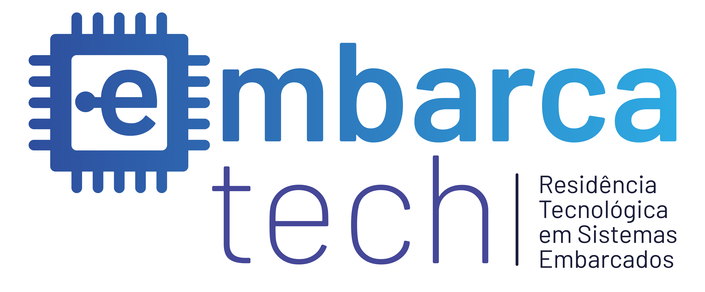

<div align="center">
    
</div>

<h2 align="center">  Sistema de Monitoramento de Composteira IoT</h3>
<h5 align="center"> Projeto final desenvolvido para o programa EmbarcaTech. </h5>

<br>

## Sobre o projeto
A descrição completa do projeto pode ser encontrada na [Documentação](/docs/) e o funcionamento do projeto no BitDogLab pode ser visto no [Vídeo de Apresentação](https://drive.google.com/drive/folders/1hXUiHSo0h73csPhoPgYV7acifhWlX10m?usp=sharing).

<br>

## Tecnologias e Ferramentas utilizadas
- **Kit BitDogLab**
- **Linguagem de programação:** C
- **Ambiente de Desenvolvimento:** Visual Studio Code

<br>

## Instruções de uso
- É necessário instalar o SDK da Raspberry Pi Pico e realizar as configurações iniciais. [1]

Para ter acesso ao projeto, clone o repositório disponível na [plataforma GitHub](https://github.com/naylane/Composteira-IoT).

Após clonar o repositório, no terminal, navegue até a pasta do projeto e execute os comandos:
```bash
mkdir build && cd build
cmake ..
make
```
Para testar com LED na Raspberry Pi Pico, altere o pino GPIO 22 por GPIO 12, conecte a BitDogLab no computador enquanto pressiona o botão `BOOTSEL` e rode o código pelo VS Code.

⚠️ **Observação:** também é possível simular a atividade pelo Wokwi no Visual Studio Code. Basta instalar a extensão e executar o arquivo 'diagram.json'.

Ou, se preferir, [clique aqui para ver a simulação no Wokwi Web](https://wokwi.com/projects/422603356971975681).

<br>

## Desenvolvedora:
<table>
  <tr>
    <td align="center"><br /> <sub> <b> Naylane Ribeiro </b> </sub>
    </td>
</table>